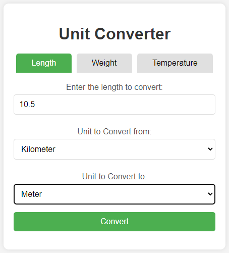

---

<div align="center">

  # Unit Converter
  
</div>
  
---

## 🎯 Overview

This project is a web-based unit converter that allows users to convert between different units of measurement for length, weight, and temperature. It is built using Java, JSP, and Servlet technologies, and is deployed on a Tomcat server.

---

## ✨ Features

- **Length Conversion:** Convert between millimeter, centimeter, meter, kilometer, inch, foot, yard, and mile.
- **Weight Conversion:** Convert between milligram, gram, kilogram, ounce, and pound.
- **Temperature Conversion:** Convert between Celsius, Fahrenheit, and Kelvin.
- **Responsive UI** User-friendly interface built with JSPs and styled with CSS.

---

## 🛠️ Technologies Used
- Java 11
- Servlet
- JSP (Java Server Page)
- Apache Tomcat
- Maven

---

## 🚀 How to Run

### 1. Clone the repository

```bash
git clone https://github.com/Farnam-Hs/Unit-Converter.git
cd Unit-Converter
```

### 2. Build the Project
Use Maven to build the project:
```bash
mvn clean install
```

### 3. Deploy to Tomcat
Add Tomcat to your IDE

### 4. Start Tomcat:
Start the Tomcat server

### 5. Access the Application
Open a web browser and navigate to:
```bash
http://localhost:8080/[Application-Context]
```

---

## 📘 Usage Example

**1. Select Conversion Type:** Choose between Length, Weight, and Temperature using the tabs.

**2. Input Value:** Enter the numeric value you want to convert.

**3. Select Units:** Choose the units you are converting from and to.

**4. Click Convert:** The converted result will be displayed.

**5. Restart:** Click on the Back button to get back to the converter page.




---

Sample solution for the [Unit Converter](https://roadmap.sh/projects/unit-converter) challenge from [roadmap.sh](https://roadmap.sh/).